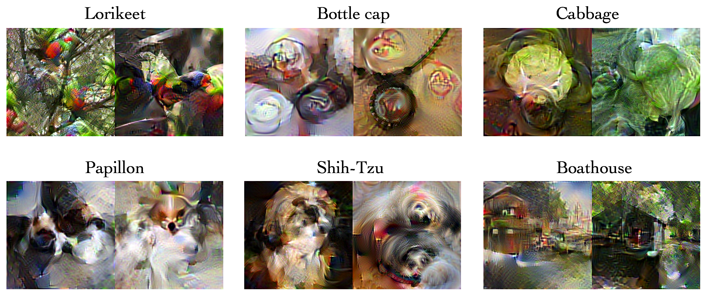

# Efficient-Dataset-Condensation
Official PyTorch implementation of **"[Dataset Condensation via Efficient Synthetic-Data Parameterization](https://arxiv.org/abs/2205.14959)"**, published at **ICML'22**



> **Abstract** *The great success of machine learning with massive amounts of data comes at a price of huge computation costs and storage for training and tuning. 
Recent studies on dataset condensation attempt to reduce the dependence on such massive data by synthesizing a compact training dataset. 
However, the existing approaches have fundamental limitations in optimization due to the limited representability of synthetic datasets without considering any data regularity characteristics.
To this end, we propose a novel condensation framework that generates multiple synthetic data with a limited storage budget via efficient parameterization considering data regularity. 
We further analyze the shortcomings of the existing gradient matching-based condensation methods and develop an effective optimization technique for improving the condensation of training data information. 
We propose a unified algorithm that drastically improves the quality of condensed data against the current state-of-the-art on CIFAR-10, ImageNet, and Speech Commands.*


## Requirements
- The code has been tested with PyTorch 1.11.0.   
- To run the codes, install efficientnet package ```pip install efficientnet_pytorch```


## Train Condensed Data
To reproduce our condensed data (except for ImageNet-100), simply run
```
python condense.py --reproduce  -d [dataset] -f [factor] --ipc [image/class]
```
- Set ```--data_dir``` and ```--imagenet_dir``` in ```argument.py``` to point the folder containing the original dataset.   
- The results will be saved at ```./results/[dataset]/[expname]```. 
- We provide specific argument settings for each dataset at ```./misc/reproduce.py```.
- In the case of **ImageNet-100**, we use the tricks below for faster optimization.

### Faster optimization
1. Utilizing pretrained networks   
    - To train pretrained networks (which were used in condensation stage), run
    ```
    python pretrain.py -d imagenet --nclass 100 -n resnet_ap --pt_from [pretrain epochs] --seed [seed]
    ```
    - In our ImageNet-100 experiments, we used ```--pt_from 5``` and train networks with 10 random seeds.
    - For ImageNet-10, ```--pt_from 10``` will be good. 


2. Multi-processing
    - We partition the classes and do condensation with multiple processors (```condense_mp.py```).
    - ```--nclass_sub``` means the number of classes per partition and ```--phase``` indicates the partition number. 

To sum up, after saving the pretrained models, run
```
python condense_mp.py --reproduce  -d imagenet --nclass 100 --pt_from 5 -f [factor] --ipc [image/class] --nclass_sub 20 --phase [0,1,2,3,4]
```
- You need to assign a different phase number to each processor.
- In the test code, we aggregate the resulted condensed data. 
- To reduce the memory requirement, use smaller ```--nclass_sub``` (#phase = #class/nclass_sub).

## Train Networks on Original Training Set
```
python train.py -d [dataset] -n [network]
```
- Our code load data on memory at the beginning. If you don't want this, set ```-l False```.
- For ImageNet, you can choose the number of subclasses by ```--nclass [#class]```.
- To save checkpoints, set ```--save_ckpt```.

## Test Condensed Data
- Set ```--data_dir``` and ```--imagenet_dir``` in ```argument.py``` to point the folder containing the original dataset (required for measuring test accuracy).   

Then run the following codes:   
```
python test.py -d [dataset] -n [network] -f [factor] --ipc [image/class] --repeat [#repetition]
```
- To evaluate **IDC-I**, set ```-f 1```. To evaluate **IDC**, set ```-f 3``` for ImageNet and ```-f 2``` for others.
- For detailed explanation for arguments, please refer to ```argument.py```

As an example, 
- To evaluate IDC (10 images/class) on MNIST and ConvNet-3 for 3 times as part of Project A Task 2, run
  ```
  python test.py -d mnist -n convnet -f 2 --ipc 10 --repeat 3
  ```
- To evaluate IDC (10 images/class) on CIFAR-10 and ConvNet-3 for 3 times, run
  ```
  python test.py -d cifar10 -n convnet -f 2 --ipc 10 --repeat 3
  ```
- To evaluate IDC (20 images/class) on ImageNet with 10 classes and ResNetAP-10 for 3 times, run
  ```
  python test.py -d imagenet --nclass 10 -n resnet_ap -f 3 --ipc 20 --repeat 3
  ```

## Citation
```
@inproceedings{kimICML22,
title = {Dataset Condensation via Efficient Synthetic-Data Parameterization},
author = {Kim, Jang-Hyun and Kim, Jinuk and Oh, Seong Joon and Yun, Sangdoo and Song, Hwanjun and Jeong, Joonhyun and Ha, Jung-Woo and Song, Hyun Oh},
booktitle = {International Conference on Machine Learning (ICML)},
year = {2022}
}
```
